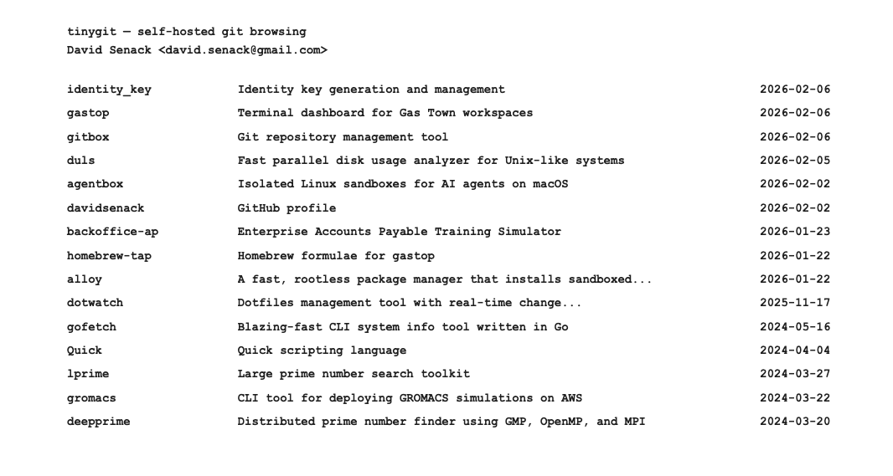

# tinygit



A minimal, read-only web interface for browsing git repositories. No JavaScript, no database, no accounts. Just bare git repos with a browsable web face.

## Install

```
git clone https://github.com/davidsenack/tinygit.git
cd tinygit
pip install .
```

This gives you the `tinygit` command.

## Usage

Start the web UI:

```
tinygit serve
tinygit serve --port 8080
tinygit serve --host 127.0.0.1 --port 3000
```

Create a new bare repo:

```
tinygit create myrepo "a short description"
```

Then push to it from your local machine:

```
git remote add origin git@yourserver:repos/myrepo.git
git push -u origin main
```

Or clone an existing repo as bare directly into your repos directory:

```
git clone --bare https://github.com/user/repo.git /srv/git/repos/repo.git
```

List all repos:

```
tinygit list
```

Delete a repo:

```
tinygit delete myrepo
```

Set a description on any repo:

```
echo "my description" > /srv/git/repos/repo.git/description
```

## Configuration

All settings are environment variables:

```
TINYGIT_REPOS_DIR        # path to bare repos (default: /srv/git/repos)
TINYGIT_SITE_NAME        # header text (default: tinygit)
TINYGIT_SITE_TAGLINE     # optional subtitle
TINYGIT_CLONE_URL_BASE   # shown in clone instructions
TINYGIT_OWNER_NAME       # your name, shown in header
TINYGIT_OWNER_EMAIL      # your email, shown in header
TINYGIT_SYNTAX_HIGHLIGHT # true/false (default: true)
TINYGIT_COMMITS_PER_PAGE # default: 30
```

## SSH setup

For push/pull access over SSH, run the setup script on your server:

```
sudo ./tinygit/setup.sh
```

This creates a `git` system user, sets up `~git/.ssh/authorized_keys`, and creates the bare repos directory. Add your public SSH key when prompted. Users can then clone with:

```
git clone git@yourserver:repos/myrepo.git
```
